# Hexiconic 💎

**[Live Web Demo](https://camchandler98.github.io/word-app-demo/)** | **[Android Testing Invite](https://play.google.com/store/apps/details?id=com.astrophysician.hexiconic)**

Hexiconic is a systems-driven word puzzle game built with **React Native** and **Python**. It moves beyond the "one-puzzle-a-day" model by utilizing a telemetry-aware content pipeline to deliver a curated, high-momentum progression experience.

> **Key Focus:** Procedural generation, state persistence, and modular mobile architecture.

> **Status:** Active development

> **Platform:** Mobile (React Native / Expo)

Welcome to a relaxing, gem-themed word puzzle game built for players who enjoy thoughtful progression, tactile feedback, and more than a single daily puzzle. Each puzzle challenges you to uncover words from a constrained letter set while earning gems, using hints strategically, and progressing through a carefully curated chapter system.

The game is designed to feel calm and rewarding rather than punishing, with flexible completion rules and a focus on forward momentum instead of perfection.

## Gameplay Overview

Each puzzle in Hexiconic follows a consistent, approachable rule set:

- Each puzzle contains **seven letters**
- One letter is designated as the **required center letter**
- All valid words must:
  - Contain the center letter
  - Be at least 4 letters long
- Letters may be reused any number of times
- **Points scale with word length**
- **Gems scale with word length**
- A puzzle is completed when the player reaches a **percentage-based score threshold**, not necessarily 100% of available points

This completion model ensures puzzles with fewer valid words still feel fair and satisfying to finish.

## Progression Loop

Hexiconic is structured around a linear, curated progression model:

1. Play a puzzle and discover words
2. Earn points and gems per word
3. Use gems to reveal hint letters when needed
4. Reach the puzzle’s completion threshold
5. Transition to a completion screen
6. Continue seamlessly into the next puzzle

Puzzles are grouped into **chapters**, and chapters are ordered to create a smooth difficulty curve rather than relying on rigid difficulty tiers.

## Hints & Economy

- Players earn **gems** naturally by finding words
- Gems can be spent to reveal letters from unrevealed valid words
- The hint system is designed to:
  - Prevent dead-ends
  - Encourage strategic spending
  - Preserve the feeling of discovery rather than brute-forcing solutions

Gems earned per puzzle are tracked independently, making future meta-systems (stores, unlocks, modifiers) possible without rewriting core logic.

## Puzzle Generation & Curation

Hexiconic doesn't just display words; it uses a multi-stage Python pipeline to transform raw dictionaries into a balanced game experience.

```mermaid
graph LR
    subgraph "Content Pipeline (Python)"
        A[Dictionary] --> B(Scoring & Filtering)
        B --> C[(💎 Puzzle DB)]
    end

    C -->|JSON Export| D

    subgraph "Hexiconic App (React Native)"
        D[Game Engine] --> E[Progress Tracker]
        E -.->|Telemetry| B
    end

    style C fill:#f9f,stroke:#333
    style D fill:#bbf,stroke:#333
```

- **Analysis:** Words are scored based on frequency and "playability."
- **Curation:** Telemetry from test builds is used to rebuild chapters, ensuring the difficulty curve is intentional, not random.
- **Optimization:** Puzzles are pre-generated to reduce runtime overhead and ensure 100% offline playability.

That pipeline includes:

- Dictionary parsing and filtering
- Word frequency analysis
- Profanity detection and whitelisting
- Subword scoring
- Puzzle telemetry collection
- Difficulty scoring
- Chapter reconstruction based on global puzzle metrics

Rather than generating puzzles randomly at runtime, Hexiconic ships with **pre-generated, telemetry-aware puzzle data**, allowing for consistent pacing and intentional difficulty progression.

## Tech Stack

### Frontend

- React Native
- Expo
- TypeScript
- Expo Router
- Layered persistence model using AsyncStorage for crash-resilient game state
-

### Architecture

- Component-driven UI
- Custom hooks for:
  - animations
  - currency handling
  - puzzle progress
- Isolated utility modules for:
  - validation
  - scoring
  - hint selection
- Clear separation between game state, UI state, and persistence

### Tooling

- Custom Python generator
- Custom telemetry tracker
- Chapter rebuilding and ordering scripts

## Save System

Hexiconic maintains two parallel save layers:

### Per-Puzzle Progress

- Found words
- Score
- Gems earned
- Hint state
- Completion flag

### Global Game State

- Current chapter index
- Current puzzle index
- Session timestamps

This structure allows:

- seamless “Continue” functionality
- mid-puzzle recovery
- future replay / remix modes without breaking saves

## Visuals

Play Store screenshots:

  
  
  

  
  

## Current Focus / Next Steps

- Chapter-level progress feedback
- Light narrative or collection-based meta layer
- Long-term replay modes (e.g. Zen / Remix)

## Why This Project Exists

Hexiconic is both:

- a **complete, playable game**
- a **demonstration of systems-driven design**

It explores:

- procedural content generation
- telemetry-informed curation
- clean React Native architecture
- balancing player agency with guided progression

---

Built with care by Cam Chandler.
